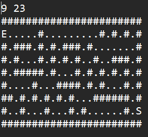

# Labirinto Robô Buscador

O objetivo do projeto é ajudar um robô a encontrar a saída de um labirinto utilizando algoritmos de busca.

### Exemplo Labirinto:

### Exemplo de Saida para esse Labirinto:

## Descrição do Problema

O robô pode se mover apenas para os quadrados imediatamente acima, abaixo, à direita e à esquerda de sua posição atual no labirinto, sem movimentos na diagonal. O labirinto é definido por um arquivo de entrada contendo vazios ('.'), paredes ('#'), ponto de entrada ('E') e ponto de saída ('S').

## Funcionalidades

- Leitura do labirinto a partir de um arquivo de entrada.
- Busca do caminho do ponto de entrada ao ponto de saída utilizando backtracking.
- Impressão do labirinto com o caminho percorrido pelo robô em um arquivo de saída.

## Instruções de Uso

1. Clone o repositório para sua máquina local.
2. Compile o código-fonte utilizando um compilador C/C++.
3. Execute o programa, fornecendo o arquivo de entrada "labirinto.txt".
4. O programa irá encontrar o caminho no labirinto e imprimir o resultado no arquivo "saida.txt".